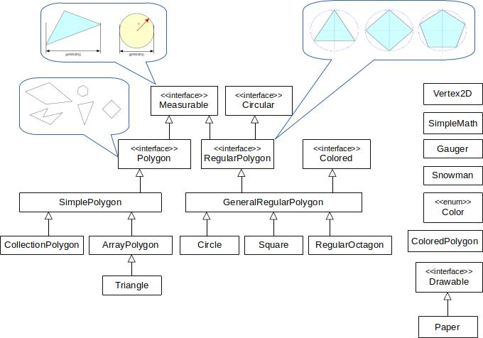

## Sedmá iterace

Cvičení zaměřené na práci s kolekcemi.

1.  Vytvořte třídu `CollectionPolygon` rozšiřující třídu `SimplePolygon`, která bude podobná třídě `ArrayPolygon`.
    Lišit se bude pouze tím, že vrcholy n-úhelníka nebudou uloženy v poli, ale ve vhodné kolekci.
    *   Třída bude mít stejný konstruktor jako `ArrayPolygon`, parametrem bude **pole** vrcholů.
        Vrcholy ze vstupního pole si uloží do kolekce, prvky si zkopíruje.
        Konstruktor taky otestuje, že samotné pole ani žádný jeho prvek není null.
        Stejný test používá i `ArrayPolygon`.
        Abyste se vyhnuli opakování kódu, přesuňte tuto část do konstruktoru nadtřídy.
    *   Vytvořte i druhý konstruktor, který bere jako parametr seznam vrcholů.
    *   Do třídy přidejte metodu `CollectionPolygon withoutLeftmostVertices()`,
        která vráti nový polygon bez nejlevějších vrcholů (může jich být víc, viz např. obdélník).
        Původní polygon zůstane nezměnen.
        Jestli polygon již žádné vrcholy neobsahuje, metoda vyhodí výjimku
        `IllegalArgumentException` s popisem chyby.
    *   Definujte metody rovnosti.
        Dva polygony jsou stejné, pokud jsou všechny indexy vrcholů stejné,
        tj. mají stejné souřadnice vrcholů se stejným pořadím.

2. Vytvořte třídu `ColoredPolygon`, který vezme existující polygon a přidá mu novou vlastnost: barvu.
    *   Konstruktor bere polygon typu `Polygon` a barvu typu `Color`.
    *   Třída obsahuje gettery na dané atributy `getPolygon` a `getColor`.
    *   Dva barevné polygony jsou stejné, jestli obsahují (logicky) stejnýpolygon i barvu.

3.  Vytvořte třídu `Paper` implementující rozhraní `Drawable`.
    Jde jednoduše o papír, na který se dají kreslit polygony.
    Nakreslené polygony se budou ukládat do kolekce jako `ColoredPolygon`.
    Když na papír nakreslíme stejný polygon (se stejnou barvou) dvakrát, uloží se jenom jednou.
    Na papír se kreslí barvou a každý polygon je pro jednoduchost jednobarevný.
    Implicitní barva je černá.
    *   První konstruktor bude bez parametrů.
    *   Další konstruktor bude brát parametr typu `Drawable` a kolekci nakreslených polygonů si zkopíruje.
    *   `changeColor(color)` změní barvu, jakou sa bude kreslit
    *   `drawPolygon(polygon)` namaluje polygon na papír (nastavenou barvou; jestli je bílá, nekreslí se nic)
    *   `erasePolygon(polygon)` odstraní polygon z papíru
    *   `eraseAll()` odstraní všechny polygony z papíru
    *   `getAllDrawnPolygons()` vrátí všechny namalované polygony
    *   `uniqueVerticesAmount()` vrátí počet vrcholů na papíře bez duplicit
    *   Více informacá najdete v javadocu třídy `Drawable`.

4. Spuštění třídy `Draw`
[vykreslí barevný domeček](https://gitlab.fi.muni.cz/pb162/pb162-course-info/wikis/draw-images).

### Hinty

- Při výběru mezi seznamem a množinou v `CollectionPolygon` myslete na to, že topologie n-úhelníka je dána pořadím
  vrcholů a že je povoleno mít více vrcholů se stejnými souřadnicemi
  (u jednoduchého n-úhelníka se sice nesmí křížit hrany, mohou se ale dotýkat).
- Proměnné by měly být typu rozhraní, tj. `List` namísto `ArrayList`, `Set` namísto `HashSet`.
- Abstraktní třída `SimplePolygon` může mít konstruktor, nedá se však přímo instanciovat.
- Pro konverzi pole na seznam existuje statická metoda `Arrays.asList`.
- Pro konverzi kolekce na pole existuje metoda `toArray`, která bere jako argument nové pole.
- Metody rovnosti kolekcí jsou definovány rozumně.
- Getter by neměl modifikovat daný atribut, proto vracejte kolekci jako **nemodifikovatelnou**.
  Tohle platí obecně, nejenom pro metodu `getAllDrawnPolygons()`!
  Nemodifikovatelné kolekce vytvoří statické metody `Collections.unmodifiableXXX`.
  Nemodifikovatelnou kolekci nemusíme vracet pouze v případě, kdy vytváříme kolekci přímo v dané metodě.
- Metody `List.of` i `Arrays.asList` vrací nemodifikovatelnou kolekci.
  Pro modifikaci je nutno vytvořit novou kolekci.

### Cílový UML diagram tříd:

