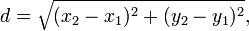

## Třetí iterace

Cvičení zaměřené na přetěžování vlastních konstruktorů a metod.

1.  Ve třídě `Vertex2D`:
    *   Udělejte ze třídy `Vertex2D` neměnnou (_immutable_) třídu, tj. odstraňte settery a nastavte všechny atributy jako `final`.
    *   Přidejte metodu `double distance(Vertex2D vertex)`, která vezme jiný 2D bod jako vstupní parametr a vrátí jeho
        eukleidovskou vzdálenost. Vzdálenost bodů se vypočítá jako:
    
    *   Pokud je vstupní argument `null`, pak metoda vrátí hodnotu `-1.0` jako indikátor chyby (vzdálenost je vždy
        nezáporná).

2.  Vytvořte třídu `Circle`.
    *   Třída bude mít konstruktor se dvěma parametry (v tomto pořadí): _střed_ (center) typu `Vertex2D`
        a _poloměr_ (radius) typu `double`.
        Atributy budou neměnné.
    *   Třída bude mít _bezparametrický konstruktor_, který vytvoří jednotkovou kružnici se středem v počátku
        souřadného systému (tj. střed `[0.0, 0.0]`, poloměr `1.0`).
    *   **Bezparametrický konstruktor bude volat parametrický konstruktor** a předá mu potřebné hodnoty.
    *   Pro poloměr a střed vytvořte gettery `getRadius()` a `getCenter()`.
    *   Metoda `toString` bude vracet řetězec ve formátu:

            "Circle: center=[<x>, <y>], radius=<radius>"

        kde `<x>` a `<y>` jsou hodnoty příslušných souřadnic středu a `<radius>` je hodnota poloměru.

3.  Upravte třídu `Triangle` následujícím způsobem:
    *   Odstraňte setter, nastavte atributy jako `final`.
        Třída nemůže být neměnná, protože metoda `divide` mění vlastnosti trojúhelníka.
    *   Přidejte metodu `boolean isEquilateral()`, která vrátí `true`, jestliže je trojúhelník rovnostranný.
        Protože pracujeme s reálnými čísly, nelze jednoduše porovnávat délky stran pomocí `d1 == d2`.
        Je nutné použít test, který bude považovat dvě reálná čísla za shodná, pokud se liší jen málo:

            Math.abs(d1-d2) < 0.001

        kde `0.001` je tolerovaná absolutní odchylka a **bude definována jako privátní konstanta**.
    *   Vytvořte přetíženou metodu `void divide(int depth)`, která rozdělí trojúhelník na podtrojúhelníky.
        Výsledkem bude [_Sierpińského trojúhelník_](http://en.wikipedia.org/wiki/Sierpinski_triangle):
             
             *Sierpińského trojúhelníky hloubky 0 až 4.*
        *   Parametr `depth` udává hloubku dělení. Nula značí žádné dělení (jsme na konci rekurze), 1 znamená,
            že dojde k jednomu rozdělení původního trojúhelníka, atd.
        *   Pokud je `depth` menší nebo rovna nule, k dělení nedojde a metoda skončí.
		*   Jinak metoda rozdělí trojúhelník pomocí metody `divide()` a rekurzivně se pokusí rozdělit vzniklé podtrojúhelníky
		    až do požadované hloubky.
    *   Vytvořte konstruktor se 4 parametry, čtvrtý parametr reprezentuje hloubku zanoření.
        Konstruktor zavolá předešlý konstruktor a pak rozdělí trojúhelník.

4.  Po spuštění třídy `Draw` se na obrazovce [vykreslí _Sierpińského trojúhelníky_ hloubky 4 a červená
    kružnice](https://gitlab.fi.muni.cz/pb162/pb162-course-info/wikis/draw-images).

### Hinty

- Metody pro matematické operátory jsou ve třídě `Math`.
  Např. odmocnina se vypočítá pomocí statické metody `Math.sqrt()`.
- Volání konstruktoru v konstruktoru se provádí klíčovým slovem `this`.
- Není potřeba volat `toString()`, metoda se zavolá automaticky.
- Konstanta musí být pouze jedna (`static`) a neměnná (`final`).
