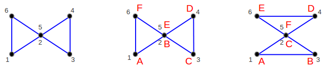
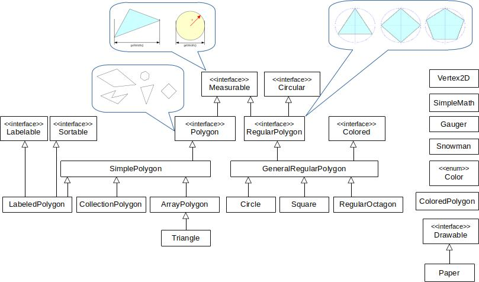

## Devátá iterace

Cvičení zaměřené na práci s uspořádanými kolekcemi (a lambda výrazy).

V předchozích iteracích jsme vytvořili několik variant jednoduchých n-úhelníků, jejichž topologie
(pořadí propojení vrcholů hranami) bylo dáno pořadím vrcholů.
Nyní si vytvoříme n-úhelník s pojmenovanými vrcholy.
Topologie bude dána abecedním pořadím názvů vrcholů.
Změnou pojmenování vrcholů tak můžeme snadno změnit topologii n-úhelníka.

Ukažme si příklad. Na následujícím obrázku je vlevo n-úhelník se šesti vrcholy.
Čísla u vrcholů představují pořadí, ve kterém byly vrcholy definovány a topologie je dána jejich pořadím.
Pokud je topologie dána pojmenováním vrcholů, pak stejného výsledku dosáhneme
pojmenováním vrcholů 1-6 písmeny A-F (obrázek uprostřed).
Přejmenování vrcholů ale můžeme zcela změnit topologii bez nutnosti měnit pořadí samotných vrcholů n-úhelníka
(obrázek vpravo).



1.  Definujte přirozené uspořádání na třídě `Vertex2D` v souladu s metodou `equals()`,
    tj. třídí se podle souřadnice X vzestupně a v případě shody se třídí podle Y vzestupně.

2.  Vytvořte `VertexInverseComparator` pro třídu `Vertex2D` v balíku `cz.muni.fi.pb162.project.comparator`.
    Komparátor bude vrcholy třídit **sestupně**, nejprve setřídí podle souřadnice X sestupně
    a v případě shody se třídí podle Y sestupně.

3.  Pomocí **uspořádané mapy** vytvořte třídu `LabeledPolygon` rozšiřující třídu `SimplePolygon`.
    Tato třída bude podobná třídám `ArrayPolygon` a `CollectionPolygon` s tím rozdílem,
    že vrcholy jsou uloženy pod svými názvy.

    Vrcholy jsou pojmenovány libovolným textovým řetězcem (nejčastěji jedním písmenem)
    a platí, že *jméno vrcholu je v rámci n-úhelníka unikátní*.
    N-úhelník však může obsahovat dva různě pojmenované vrcholy se stejnými souřadnicemi
    (viz situace na výše uvedeném příkladu).

    Pořadí vrcholů v n-úhelníku je dáno jejich pojmenováním (lexikograficky vzestupně).

    Třída bude mít **privátní** konstruktor s jedním parametrem -- mapou vrcholů a jejich labelů.
	
    Třída se nebude dát dědit (bude finální).

    Implementujte nasledující rozhraní (pro více informací viz JavaDoc daného rozhraní).

    Metody z rozhraní `Polygon`:
    *   `Vertex2D getVertex(int index)` vrátí index-tý vrchol vzhledem k pořadí danému pojmenováním vrcholů.
        Pokud např. máme vrcholy "A", "B" a "C", tak nultý vrchol je "A",
        první vrchol "B", druhý vrchol "C", třetí vrchol opět "A" (modulo) apod.
    *   `int getNumVertices()` vrátí počet vrcholů v kolekci.

    Implementujte rozhraní `Labelable`:
    *   `Vertex2D getVertex(String label)` vrátí souřadnice vrcholu se jménem `label`.
        Metoda vyhodí výjimku `IllegalArgumentException` pokud takový vrchol neexistuje.
    *   `getLabels()` vrátí kolekci názvů vrcholů uspořádaných lexikograficky **vzestupně**.
    *   `getLabels(Vertex2D vertex)` vrátí všechna jména vrcholů se souřadnicemi `vertex`.
        Pokud žádný takový vrchol neexistuje, vrátí prázdnou kolekci.

    Implementujte rozhraní `Sortable`:
    *   `Collection<Vertex2D> getSortedVertices()` vrátí vrcholy setříděné podle přirozeného uspořádání bez duplicit.
    *   `Collection<Vertex2D> getSortedVertices(Comparator<Vertex2D> comparator)` vezme libovolný komparátor 2D vrcholů
        a vrátí vrcholy setříděné podle daného komparátoru bez duplicit.

    Nakonec metoda `Collection<Vertex2D> duplicateVertices()` vrátí množinu vrcholů,
    které jsou v polygonu vícekrát pod různým názvem.
> Pokud nevracíme novou kolekci, je potřeba vrátit kolekcii jako nemodifikovatelnou.

4. Vytvořte **vnitřní** třídu `Builder`, tj.`LabeledPolygon.Builder`.
   Třída bude statická, tj. k jejímu používání není nutná instance třídy `LabeledPolygon`.
   Tahle třída se postará o vytvoření polygonu.
   *   Třída bude implementovat rozhraní `Buildable`.
   *   Metoda `Builder addVertex(String label, Vertex2D vert)` uloží vrchol pod daným názvem.
       Název ani vrchol nesmí být `null`, jinak metoda selže s vhodnou výjimkou.
       Pokud již pod daným názvem vrchol v n-úhelníku existuje, vymění se za nový.
   *   Metoda `LabeledPolygon build()` vrátí novou instanci `LabeledPolygon` naplněnou vrcholy.
   *   Použití:
       ```java
       LabeledPolygon polygon = new LabeledPolygon.Builder()
            .addVertex("A", new Vertex2D(2, 5))
            .addVertex("B", new Vertex2D(3, 1))
            .addVertex("C", new Vertex2D(1, 3))
            .build();
       ```

5.  Pokud jste implementaci provedli bez chyb, tak po spuštění třídy `Draw`
    se na obrazovce vykreslí [polygon s pojmenovanými vrcholy
    ](https://gitlab.fi.muni.cz/pb162/pb162-course-info/wikis/draw-images)
    podobný prostřednímu polygonu nahoře.

### Hinty

- Pro primitivní typy existují statické metody pro porovnávání, např. `Double.compare`.
- Pro statickou interní třídu `Builder` stačí volat `LabeledPolygon.Builder()` namísto `LabeledPolygon().Builder()`.

### Cílový UML diagram tříd:


