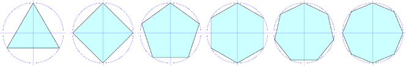
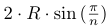
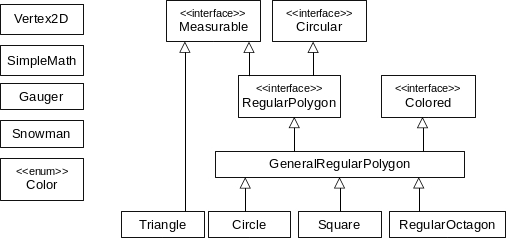

## Pátá iterace

Cvičení zaměřené na práci s dědičností, rozhraním i výčtovým typem.

Mezi obrazce 2D geometrie patří [pravidelné 
mnohoúhelníky](http://cs.wikipedia.org/wiki/Pravideln%C3%BD_mnoho%C3%BAheln%C3%ADk)
 (anglicky _regular polygons_, nebo zkráceně _n-gons_).

Jsou to pravidelné hranaté konvexní objekty, které mají všechny strany stejně dlouhé (rovnostranný trojúhelník, čtverec, pravidelný pětiúhelník, atd.).
Lze jimi opsat kružnici, která prochází všemi vrcholy. Odpovídají tedy naší definici "kruhových objektů" definovaných rozhraním `Circular`.
Dá se mezi ně zařadit i kružnice jakožto n-úhelník s nekonečně mnoha nekonečně malými hranami 
(ve skutečnosti každý pravidelný n-úhelník aproximuje kružnici &mdash; čím víc hran, tím je aproximace přesnější).

1. V balíku `geometry` vytvořte výčtový typ `Color`, definujte několik běžných barev.
   Přepište metodu `toString()`tak, že vrátí jméno barvy malými písmeny.

2. V balíku `geometry` vytvořte rozhraní `Colored` obsahující `get` a `set` metodu typu definovaného výčtového typu.
   Metody se budou jmenovat `getColor()` a `setColor()`. Řádně je popište.

3.  V balíku `geometry` vytvořte třídu `GeneralRegularPolygon` implementující rozhraní `RegularPolygon` a `Colored`.
    Tato třída pak bude sloužit jako společná nadtřída pro všechny pravidelné n-úhelníky.
    *   Pravidelný n-úhelník je definován svým _středem_, _počtem hran_ a _poloměrem opsané kružnice_.
        Konstruktor proto bude mít právě tyto tři parametry.
    *   Implicitní barva je černá (`BLACK`).
    *   Délka hran se vypočítá jako:
        ,
        kde `R` je poloměr opsané kružnice a `n` je počet hran.
    *   Šířka a výška pravidelného n-úhelníka se spočítá jako průměr opsané kružnice.
    *   Souřadnice i-tého vrcholu se vypočítá podle následujícího vzorečku:

        x = Cx - R * cos(i * 2 * PI / n)

        y = Cy - R * sin(i * 2 * PI / n)

        kde `C` je střed, `R` je poloměr kružnice, `n` je počet hran a `i` je index vrcholu.
    *   Metoda `toString` bude vracet:

            "<n>-gon: center=
, radius=<radius>, color=<color>"

        kde _\<n\>_ je počet hran, _\<center\>_ je střed a _\<radius\>_ je poloměr opsané kružnice
        a _\<color\>_ je barva.

4.  V balíku `geometry` vytvořte třídu `RegularOctagon` pro pravidelný osmiúhelník rozšiřující `GeneralRegularPolygon`.
    Konstruktor obsahuje pouze nezbytné parametry.

5.  Upravte třídu `Circle` tak, aby rozšiřovala třídu `GeneralRegularPolygon`.
    *   Počet hran kružnice je konstanta _maximální celé číslo_ typu `int`.
    *   Implicitní barva kružnice je červená.
    *   Kružnice se i nadále bude dát zkonstruovat zadáním středu a poloměru.
    *   Pročistěte třídu, tj. smažte všechny nepotřebné atributy i metody, atd.
    *   Třída bude obsahovat původní metodu `toString`.
    *   Zděděná metoda `getEdgeLength()` by pro kružnici nefungovala správně, protože délka hran má být 0
         &mdash; překryjte ji.

6.  Upravte třídu `Square` tak, aby rozšiřovala třídu `GeneralRegularPolygon` a pak ji pročistěte.
    Nechte pouze konstruktory a metodu `toString`.
    Metoda `getVertex` bude fungovat stejně jak je definováno v rozhraní.

7.  Upravte třídu `Snowman`:
    *   Sněhulák nebude složen ze čtyř opsaných kružnic, ale ze **tří** pravidelných mnohoúhelníků.
    *   Konstruktor bude jako svůj první parametr brát parametr typu `RegularPolygon`.
    *   Metoda `RegularPolygon[] getBalls()` bude pak vracet pole pravidelných n-úhelníků.
    *   Mnohoúhelníky sněhuláka budou mít stejný počet hran jako spodní (první) mnohoúhelník.

8. Demo vypíše pravidelný osmiúhelník se středem `[0, 0]` a poloměrem `1`.

9. Draw vykreslí [dva sněhuláky z opsaných kružnic i s danými 
   polygony](https://gitlab.fi.muni.cz/pb162/pb162-course-info/wikis/draw-images).

### Hinty

- Metoda `toString()` v `enum` defaultně vrací název konstanty velkými písmeny.
- Potřebné matematické funkce a konstanty naleznete ve třídě `java.lang.Math`.
- Metoda `getVertex(int index)` předpokládá libovolné číslo a nevyžaduje modulo,
  protože goniometrické funkce tak fungují automaticky.
- Pro lepší porozumění mnohoúhelníků sněhuláka mrkněte na ukázkový screenshot _Draw_.

### Cílový UML diagram tříd:

