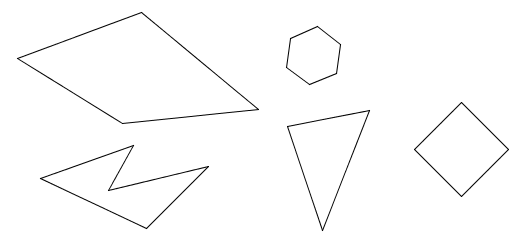
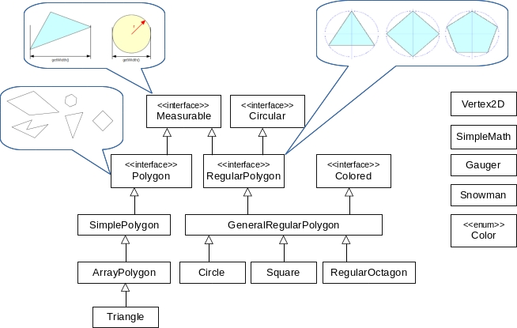

## Šestá iterace

Cvičení zaměřené na práci s polem, rovností, abstraktní třídou a dědičností.

V předchozích iteracích jsme pracovali s pravidelnými n-úhelníky. Nyní si systém rozšíříme o obecnější tzv. jednoduché n-úhelníky.
To jsou obecné nepravidelné uzavřené n-úhelníky bez vzájemně se protínajících hran, jak ukazují následující příklady:

Přestože pravidelný n-úhelník je speciální případ jednoduchého n-úhelníka, v našem případě budou hierarchie tříd
_pravidelné n-úhelníky_ a _jednoduché n-úhelníky_ oddělené. Je to z toho důvodu, že pravidelné n-úhelníky máme definovány pomocí
poloměru opsané kružnice a počtu hran, zatímco jednoduché n-úhelníky musí být z principu definovány pomocí seznamu souřadnic
jednotlivých vrcholů.

1.  Definujte rovnost dvou vrcholů (`Vertex2D`) tak, že dva vrcholy jsou stejné, pokud mají stejné souřadnice.

    >   Nezapomeňte, že předefinováním rovnosti máte povinnost předefinovat ještě jednu metodu.

2. Metody v `SimpleMath` upravte tak, aby brali jako parametr rozhraní `Polygon`.
   Rozhraní `Polygon` definuje metody obecného n-úhelníka.

3.  V balíku `geometry` vytvořte *abstraktní* třídu `SimplePolygon` implementující rozhraní `Polygon`.
    Třída `SimplePolygon` bude obecná v tom smyslu, že nebude předjímat způsob uložení jednotlivých vrcholů (polem, kolekcí apod.).
    To nechá až na podtřídy. Bude tedy implementovat pouze následující metody, ostatní zůstanou neimplementované:
    *   Metoda `getHeight()` vrátí rozdíl mezi největší a nejmenší souřadnicí Y v n-úhelníku.
        Podobně `getWidth()` pro X-ové souřadnice.
    *   Metoda `toString()` vrátí řetězec:

            "Polygon: vertices = [x, y] [x, y] [x, y]"

        kde [x, y] jsou postupně všechny souřadnice vrcholů.

4.  Vytvořte neměnnou třídu `ArrayPolygon` rozšiřující třídu `SimplePolygon`.
    *   Souřadnice vrcholů n-úhelníka budou uloženy ve formě pole.
    *   Konstruktor bude mít jako vstupní argument pole vrcholů.
        * Na začátku se ověří, jestli není pole, nebo některý jeho prvek `null`.
          Pokud není vstupní pole validní, vyhodí výjimku `IllegalArgumentException` s vhodnou zprávou.
        * Konstruktor si vstupní pole zkopíruje (nestačí tedy pouze uložit ukazatel na pole do atributu,
          pak by šlo vytvořený objekt modifikovat, co nechceme).
    *   Metoda `Vertex2D getVertex(int i)` vrátí i-tý vrchol modulo počet vrcholů.
        V případě záporného vstupního argumentu vyhodí výjimku `IllegalArgumentException` **s popisem chyby**.
    *   Definujte metody rovnosti. Dva `ArrayPolygony` jsou stejné, pokud jsou všechny indexy vrcholů stejné.
		Pro porovnání tříd použijte `getClass()`, nikoliv `instanceof`. Důvod viz přednáška.

        **Př.** *Následující trojúhelníky **nejsou** stejné*:
        *   [1, 1] [2, 2] [3, 3]
        *   [3, 3] [1, 1] [2, 2]

5.  Upravte třídu `Triangle` tak, aby rozšiřovala třídu `ArrayPolygon`:
    *   Konstruktor zůstane v původní podobě, tj. bude brát tři konkrétní vrcholy jako svoje vstupní argumenty
        a předá je konstruktoru nadtřídy v podobě pole vrcholů.
    *   Zrušte všechny atributy a metody, které lze zdědit beze změny, kromě metody `toString()`.

6. Pokud jste implementaci provedli bez chyb, tak po spuštění třídy `Draw` se na obrazovce vykreslí [fialový trojúhelník
   a uvnitř něj fialový polygon](https://gitlab.fi.muni.cz/pb162/pb162-course-info/wikis/draw-images)
   (v jeho tvaru nehledejte žádný smysl :wink: ).

### Hinty

- Nezapomeňte v `SimpleMath` upravit i Javadoc.
- Pro implementaci `SimplePolygon` využijte metod ze `SimpleMath`.
- **V abstraktní třídě explicitně napište hlavičky abstraktních metod.**
- Využijte metody z utility třídy `Arrays`, např. _copyOf_ nebo _equals_.
- Při kopírovaní pole stačí plytká kopie, protože objekty typu `Vertex2D` jsou neměnitelné.
- Znak modulo je v Javě reprezentován `%`.
- Privátní atribut = viditelný v rámci stejné třídy; nemusí to být pouze objekt `this`.
- Pro výčet prvků pole použijte následující syntax: `new Vertex2D[] { /* elements */ }`.
- Ve třídě `Triangle` pamatujte na kontrakt metody `equals`: metoda musí být symetrická,
  tj. `new ArrayPolygon(...).equals(Triangle(...))` musí vrátit stejný výsledek jako
  `Triangle(...).equals(new ArrayPolygon(...))`.
  I kdyby byly body trojúhelníku i polygonu stejné, `equals` vrací `false`, protože jde o různé třídy.

### Cílový UML diagram tříd:

