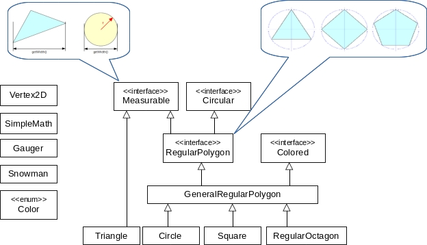

## Fifth iteration

Exercise focused on working with inheritance, interfaces, and enumeration type.

2D geometry shapes include [regular polygons](https://en.wikipedia.org/wiki/Regular_polygon).

They are regular convex objects that have all sides of the same length (e.g., equilateral triangle, square, regular pentagon, etc.).
- These objects match our definition of "circular objects" defined in the previous iteration by the `Circular` interface.
- Another interesting observation is that a circles can be considered an regular polygon with infinitely many infinitesimal edges (from the opposite point of view, any regular polygon approximates a circle &mdash; the more edges, the more accurate the approximation).

Our goal is to propose an object decomposition reflecting these observations. Moreover, we want to color 2D objects.

1. In the `geometry` package, create an enumeration type `Color`, define some common colors, e.g., white, red, green, etc. Override the `toString()` method so that it returns the color name **in lowercase**.
   > By default, the `toString()` method in `enum` returns the name of the constant in uppercase.

2. In the `geometry` package, create a `Colored` interface containing `get` and `set` method of the type of the defined enumeration type. The methods will be named `getColor()` and `setColor()`. Describe them properly.

3.  In the `geometry` package, create a `GeneralRegularPolygon` class that implements the `RegularPolygon` and `Colored` interfaces. This class will then serve as a common superclass for all regular polygons.
    *   A regular polygon is defined by its _center_, _number of edges_, and _radius of a circumscribed circle_.
        Therefore, the constructor will have exactly these three parameters.
    *   The default color is black.
    *   The length of the edges is calculated as:
        ,
        where `R` is the radius of the circumscribed circle and `n` number of edges.
    *   The width and height of a regular polygon are calculated approximately as the diameter of the circumscribed circle.
    *   The coordinates of the i-th vertex are calculated according to the following formula: 
    
            x = Cx - R * cos(i * 2 * PI / n)
            y = Cy - R * sin(i * 2 * PI / n)
            
        where `C` is the center, `R` is the radius of the circle, `n` is the number of the edges and `i` is the index of the vertex.
	    > You will find the necessary mathematical functions and constants in the `java.lang.Math` class.

    *   Method `toString` will return:
    
            <n>-gon: center=
, radius=<radius>, color=<color>
            
        where _\<n\>_ is the number of the edges, _\<center\>_ is the center and _\<radius\>_ is the radius of the circumscribed circle and _\<color\>_ is the color of the regular polygon.

4.  In the `geometry` package, create a `RegularOctagon` class (polygon with eight edges) extending the `GeneralRegularPolygon`. The constructor contains only the necessary parameters.

5.  Refactor the `Circle` class to extend the `GeneralRegularPolygon` class.
    *   The number of the edges of a circle is a constant _maximum integer_ of type `int`.
    *   The default color of the circle is red.
    *   The circle can still be constructed by entering the center and radius, as before.
    *   Clean up the class, i.e., delete all unnecessary attributes and methods inherited from parent class(es).
    *   The class will contain the original `toString` method.
    *   An inherited `getEdgeLength()` method would not work properly for a circle because the length of the edges should be 0
        &mdash; override it.

6.  Refactor the `Square` class to extend the `GeneralRegularPolygon` class, and then clean it up (remove all unnecessary attributes and methods). The `getVertex` method will work as defined in the interface, i.e., the vertex is computed likewise in the other regular polygons.

7.  Edit the `Snowman` class:
	> For a better understanding of snowman polygons, take a look at the sample _Draw_ screenshot.

    *   The snowman will not be composed of four circumscribed circles, but of **three** regular polygons (drawn by Picasso ;-)
    *   The constructor will take a parameter of type `RegularPolygon` as its first parameter.
    *   The `RegularPolygon[] getBalls()` method will then return an array of regular polygons.
    *   Snowman polygons will have the same number of edges as the bottom (first) polygon.

8. The demo prints a regular octagon with center `[0, 0]` and radius `1`.

9. Draw draws [two snowmen, one from circumscribed circles and one from the given polygons](https://gitlab.fi.muni.cz/pb162/pb162-course-info/wikis/draw-images).

### Target UML class diagram:

